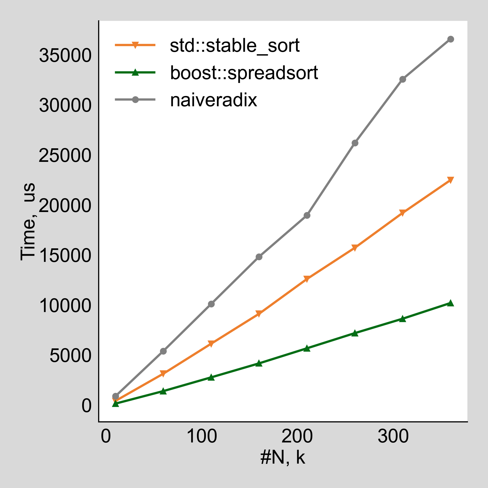

# This repo is for experiments for sorting

It is related with [jira-ARROW-10899](https://issues.apache.org/jira/browse/ARROW-10899).
It is required to develop a fast and stable sorting algorithms for integers.

This repo contains benchmarks for `std::sort`, `std::stable_sort`, `boost::spreadsort`.
The last one demonstrates the best performance but it is not stable.
Yet I believe it might be reimplemnted to be stable, so I've copied isolated code of `boost::integer_sort` to experiment with it.
I think it might be done by using `stable_sort` instead of `boost::pbqsort` and by making sorting not in place.

This repo also contains images for benchmarks.

