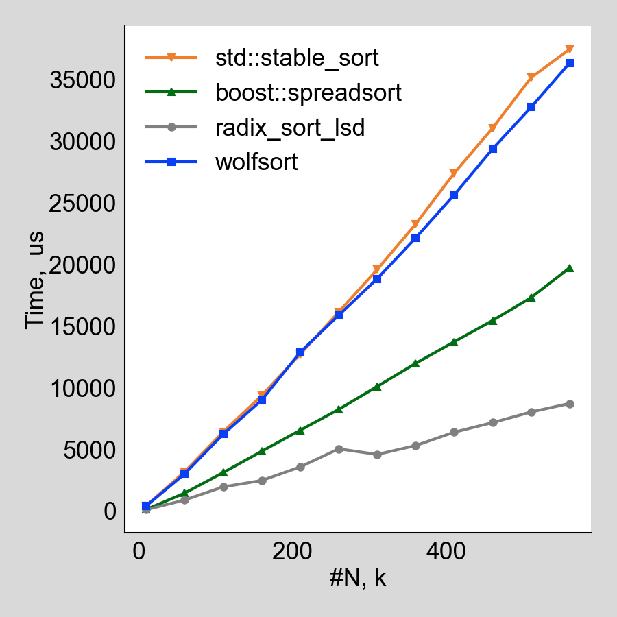
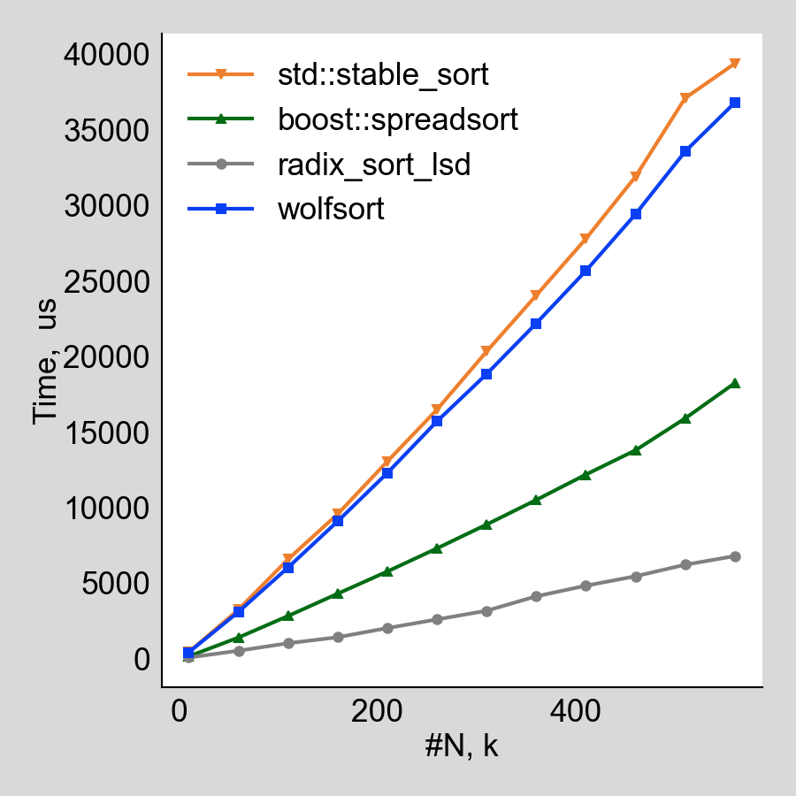

# Radix sort implementation

## About

This repo is to provide a fast and stable implementation of radix sort.
The implementation is intended to be used in Apache Arrow, see [jira-ARROW-10899](https://issues.apache.org/jira/browse/ARROW-10899).


## How to build and run benchmarks

Build:

```bash
mkdir build && cd build
cmake ..
make
```

Run benchmarks and generate plots:

```bash
cd scripts
./runAll.sh
```

Plots can be found in `scripts/imgs`.

## Discussion

In this work we are interested in developing a hybrid sorting algorithm for sorting integers which is stable and faster than `std::stable_sort`.
A well-known fast integers sorting algorithm is `boost:spread_sort` but it is not stable so we consider it just for comparison but are not going to use it.

We will benchmark radix sort implementations.
Namely, LSD radix sort, MSD radix sort, and hybrid radix sort algorithm.

### Vanila radix sorts vs other sorting algorithms

<div>

<p>Figure 1. Performance of the selected sorting algorithms on shuffled unique values</p>
</div>

In Figure 1, we apply selected sorting algorithms to a shuffled sequence of 64bits integers.
We observe that both MSD and LSD radix sort implementations outperforms significantly other algorithms.
LSD radix sort is faster only by 6% than the MSD implementation.

<div>

<p>Figure 2. Performance of the selected sorting algorithms on values from uniform distribution for for the range 0..1e9</p>
</div>

Now consider Figure 2.
For this benchmark we generate uniformly distributed numbers in the range `[0, 1e9]`.
LSD radix sort appears to be several times faster than other sorting algorithms.
But, quite surprisingly, MSD radix sort performs poorly.

TODO: Requires additional investigation:
* Why MSD performs so pourly?
* Why plot for MSD has peaks?

### MSD radix sort performance on different distributions

Consider the performance of selected sorting algorithms on the different data distrubtions.
The size of the sequence if 400k for all the tests.

<div>

<p>Figure 3. Various distributions</p>
</div>

MSD and LSD implementations have comparable performance on most of the distributions.
But on the sequence with only one unique value and almost sorted sequence LSD performs faster.

It is interesting that `boost::spread_sort` performs so good on ascending/descending/almostsorted/fewunique sequence.
TODO: 
* Do they detect these cases or it is the property of the underlying sort algorithm?
* Is it possible to reuse their approach for the hybrid radix sort algorithm which we want to develop.


### MSD vs LSD radix sort

In this section we are comparing MSD and LSD radix sorts.
LSD radix sort used here as a reference is developed by Travis Downs, [see his blog for details](https://travisdowns.github.io/blog/2019/05/22/sorting.html).
This implementation is characterized by several optimizations:
1. Skip trivial iterations. It means that all the values are in the one bucket.
2. Precompute offsets.
3. Use array of pointers instead of array of offsets.

First, we consider sorting array of shuffled numbers from the range `[0, n]`, where `n` is the lenght of the input.

From the Figure 2, we observe that on the employed input LSD consistently overperforms the MSD implementation.

Profiling shows the following two hot places in the implementation of MSD radix sort:

```asm
      │     constexpr auto partFunc = [](T v, size_t i) -> int { return (v >> i) & RADIX_MASK; }; 
2.33  │ 68: mov    (%rdi),%rax
0.03  │     add    $0x8,%rdi       
2.23  │     shr    %cl,%rax
      │    _ZN8msd_impl13radix_msd_recERSt6vectorImSaImEES3_mmm():  
      │     ++freq[partFunc(value, shift)];
0.02  │     movzbl %al,%eax
36.88 │     addq   $0x1,-0x1030(%rbp,%rax,8)
      │     for (size_t i = lo; i < hi; ++i) {                                                                                                          
...
      │     *queue_ptrs[index] = value;
2.31  │     mov    -0x830(%rbp,%rdi,8),%r8 
5.55  │     mov    %r11,(%r8)
```

Basically, `36.88%` of the MSD runtime is spent on reading data from the input array.
Writing data to the desired place takes significantly less.
`addq` is hot because we compute histograms each pass while for the case of LSD implementation it is possible to precompute the histograms for each shift.
In that case, we visit each element in the array once:

```bash
for (size_t i = 0; i < count; i++) {
  uint64_t value = a[i];
  for (size_t pass = 0; pass < RADIX_LEVELS; pass++) {
    freqs[pass][value & RADIX_MASK]++;
    value >>= RADIX_BITS;
  }
}
```

Unfortunately, it is not possible to do the same optimization for MSD sort.

Nevertheless, MSD looks attractive because it is supposed to consume less bandwidth.
To estimate difference in bandwidth consumption, we have employed `LLC-load-misses` and `LLC-store-misses` events:

```bash
perf stat -e LLC-loads,LLC-load-misses,LLC-stores,LLC-prefetches ./radix --benchmark_min_time=2 --benchmark_filter=SortingBmk_allUnique/RadixSortMSD/*
```

Number of events is not very valuable information but the ratio between number of these events for LSD and MSD implementation is interesting:

| event             | LSD/MSD  |
| :---              |  :----:  |
| LLC-load-misses   |  2.45    |
| LLC-store-misses  |  3.62    |

These measurments are not very stable, so we had to average them among several runs.
Probably, there exists a better way to estimate bandwidth consumption.


### Hybrid MSD/LSD radix sort

On the ways to improve performance of MSD radix sort is to use LSD when the size of the subarray is less than some threshold.
This is implemented in hybrid radix sort implementation.

We tested this implementation on the CPU with L1 cache size of 32K but the optimal size of the threshold is 16K.
This might be due to the fact that the current implementation uses additional buffer of size `N`.

| event             | LSD/Hybrid  |
| :---              |  :----:  |
| LLC-load-misses   |  1.8    |
| LLC-store-misses  |  3.5    |

For this implementation there is some growth in load misses but it also gives some perfoormance gain.

TODO continue this section

<div>

<p>Figure 4. Performance of the selected sorting algorithms on shuffled unique values</p>
</div>

<div>

<p>Figure 5. Performance of the selected sorting algorithms on values from uniform distribution for for the range 0..1e9</p>
</div>

